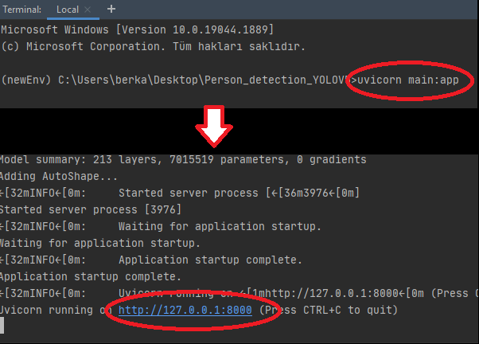
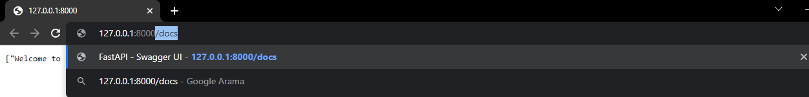
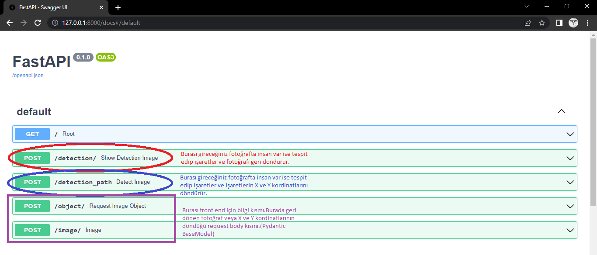
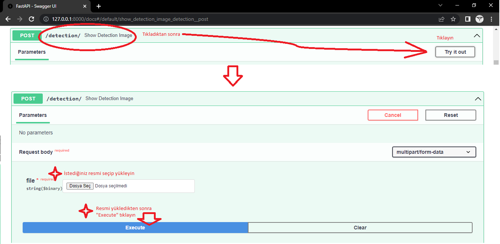
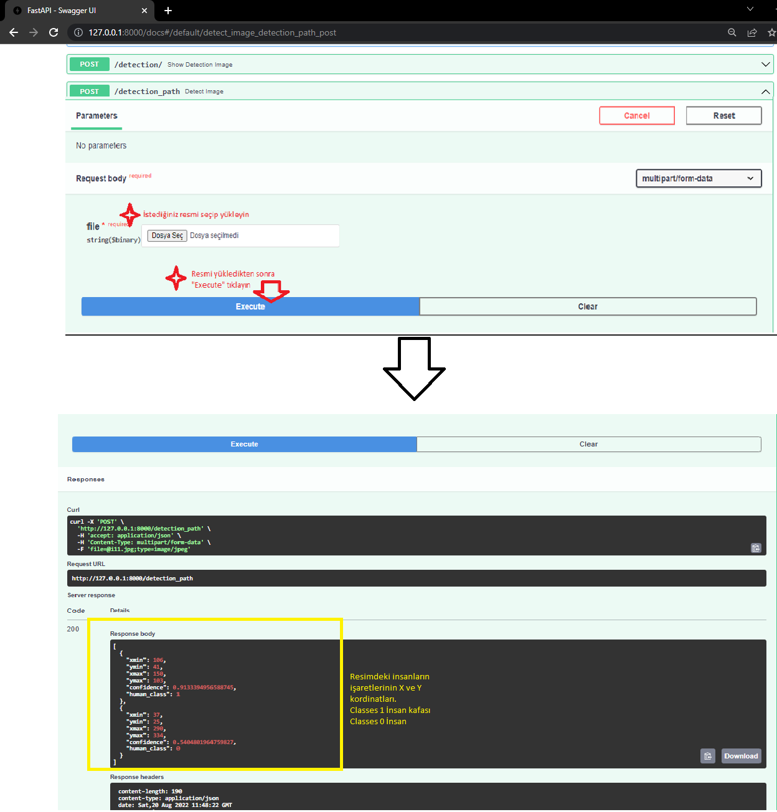

# Person-Detection-YOLOV5
Crowdhuman veri setiyle Yolov5 kullanılarak eğitilmiş insan ve insan kafası tespiti yapan program.Programda Fastapi frameworku kullanılmıştır.

Crowdhuman veri seti: https://www.crowdhuman.org/

Yolov5 eğitim için kullandığım colab linki: https://colab.research.google.com/github/roboflow-ai/yolov5-custom-training-tutorial/blob/main/yolov5-custom-training.ipynb

Öncelikle indirmeniz gereken birçok model var bunları indirmek için PyCharmın terminaline pip install -r requirements.txt yazın.(Bu kısım biraz uzun sürebilir)

İşlem bittikten sonra tekrardan terminale aşağıda resimde gördüğünüz komutu yazın.

Linke tıkladıktan sonra açılan sayfadan linkin sonuna aşağıdaki resimdeki gibi /docs yazın ve enter tuşuna basın.

Çalışacağımız yer burası.

Denemeye buradan başlayalım resimde gördüğünüz adımları uygulayın ve yüklediğiniz resimdeki insanları ve insan kafalarını yapay zeka bulsun ve size kare veya dikdörtgen içine alıp göstersin.

Burayıda bir önceki adımdaki gibi deneyip dikdörtgenlerin veya karelerin X ve Y kordinatlarını alabilirsiniz.

